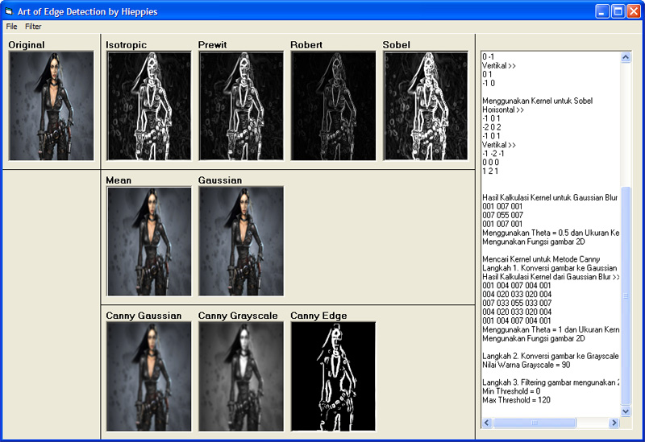



## Art of Edge Detection

### Description

Detect any edge of pictures. contain Isothropic, Prewit, Robert, Sobel, Canny, Gaussian. Take a Look.
 
### More Info
 

             |
---                |---
**Submitted On**   |2009-07-24 00:14:30
**By**             |[Hieppies](https://github.com/Planet-Source-Code/PSCIndex/blob/master/ByAuthor/hieppies.md)
**Level**          |Intermediate
**User Rating**    |5.0 (15 globes from 3 users)
**Compatibility**  |VB 6\.0
**Category**       |[Graphics](https://github.com/Planet-Source-Code/PSCIndex/blob/master/ByCategory/graphics__1-46.md)
**World**          |[Visual Basic](https://github.com/Planet-Source-Code/PSCIndex/blob/master/ByWorld/visual-basic.md)
**Archive File**   |[Art\_of\_Edg2162889182009\.zip](https://github.com/Planet-Source-Code/hieppies-art-of-edge-detection__1-72467/archive/master.zip)

